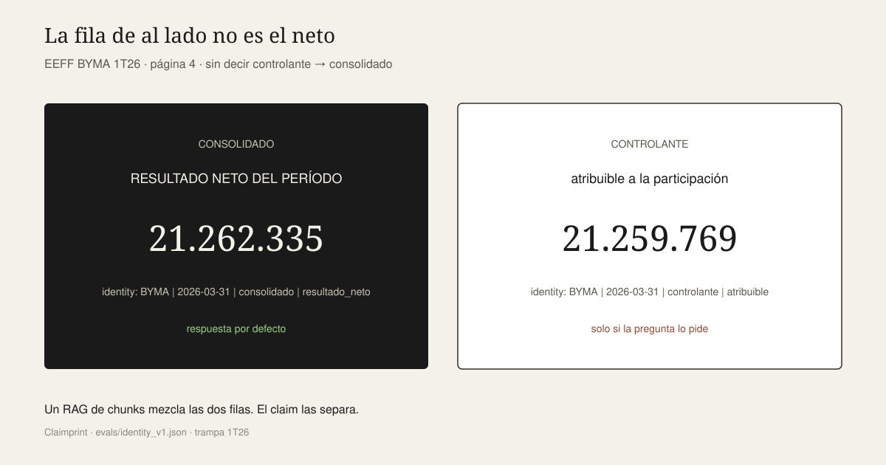
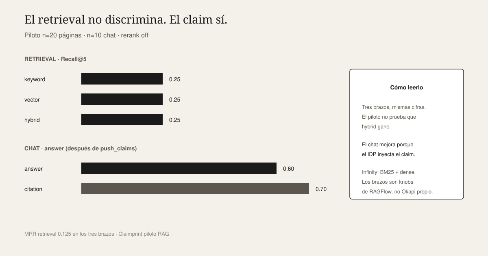

# Claimprint

[](https://github.com/javi2481/claimprint/actions/workflows/ci.yml)

**Kernel:** claims intelligence  
**First instance:** finance / BYMA  
**Rule:** no claim, no answer.

Claimprint extracts and evaluates structured claims before retrieval-augmented generation is allowed to answer. This repository ships the **first instance**: finance, over BYMA statements in [`docs/archivos_muestra/`](docs/archivos_muestra/). Other verticals would add recipes and projectors; they are not in this tree.

Recipes and [`evals/`](evals/) define the figures. The RAGFlow chat consumes them and is **not** the source of truth.

## The problem

Unspecified “net income 1T26” has two neighboring P&L rows. Retrieval can return the controlling interest. The kernel does not.

| | Value |
|--|--|
| Question | ¿Cuál es el resultado neto del período 1T26? |
| Wrong neighbor (controlante) | 21259769 |
| Claimprint (consolidado) | **21262335** |



Identity lookup: no Docker, no API keys.

### How Claimprint works

Claimprint is a **claims intelligence kernel**, not a RAG wrapper. A document enters Document Intelligence (parse, classify, extract) and becomes a **typed claim**: a structured figure with **identity** (which line item it is), **value**, and **provenance** (page, row, filing). Identity is resolved and verified before any answer is emitted. The primary path is **exact lookup** → verified answer. RAG chat is an **optional** layer that consumes verified claims; it is not the source of truth. If no claim passes verification, the kernel **abstains**—no claim, no answer.


### Why retrieval alone is not enough

The pilot compares retrieval-only search (PDF+page, **no claim inject**) against **claims-first** grounded chat (**after** `push_claims` injects IDP figures).

Retrieval (n=20, rerank off): keyword, vector, and hybrid **tie** at Recall@5 **0.25** and MRR **0.125**. The pilot does **not** show hybrid winning. The underlying issue is the **identity trap**: retrieval can return evidence for a correct number attached to the wrong figure—consolidado vs controlante in the table above.

Claims-first chat (n=10): answer **0.60**, citation **0.70**. Those scores are task-specific and measured post-inject; they reflect verified claims entering the chat, not a retrieval improvement.



Parsed BYMA text lives in [`fixtures/mineru/`](fixtures/mineru/). [`scripts/idp_ask.py`](scripts/idp_ask.py) answers that question from those fixtures. The RAGFlow UI is optional (≥16 GB RAM and local API keys). `.env` is gitignored.

## Quick start

```bash
git clone https://github.com/javi2481/claimprint.git
cd claimprint
uv venv && uv pip install -r requirements-dev.txt
./scripts/check.sh
python scripts/idp_ask.py "¿Cuál es el resultado neto del período 1T26?"
# → 21262335
python scripts/idp_ask.py "¿Cuál es la fecha del comunicado de prensa 1T26?"
# → 2026-05-08
python scripts/idp_ask.py "¿Cuál es el EBITDA de la presentación 1T26?"
# → 72128
python scripts/idp_ask.py "¿Cuál es el margen EBITDA LTM del comunicado de prensa 1T26?"
# → 76
python scripts/review_pack.py   # outputs/review.html (HITL)
python scripts/informe.py       # outputs/dossier.html
```

On Windows, run `./scripts/check.sh` from Git Bash or WSL.

## Terminal flow

Two paths through `idp_ask`: answer when a verified claim exists, abstain when the question is off-corpus or unsupported.

**Answer path**

```
Question: ¿Cuál es el resultado neto del período 1T26?
   ↓
Identity intent (consolidado | resultado_neto | 2026-03-31)
   ↓
Candidate claims (from fixtures → extract → store)
   ↓
Verified claim  BYMA|2026-03-31|consolidado|resultado_neto = 21262335
   ↓
Answer          21262335  (page 4, RESULTADO NETO DEL PERÍODO)
```

```bash
python scripts/idp_ask.py "¿Cuál es el resultado neto del período 1T26?"
# route: identity · claims[0].value: 21262335
```

**Abstain path**

```
Question: ¿Cuál fue el precio de cierre de YPF en BYMA el 3 de enero?
   ↓
Ambiguous / unsupported (off_corpus — no YPF price in corpus)
   ↓
ABSTAIN         route: abstain · claims: []
```

```bash
python scripts/idp_ask.py "¿Cuál fue el precio de cierre de YPF en BYMA el 3 de enero?"
# route: abstain · abstain_reason: off_corpus
```

Extraction follows the same rule: if the issuer cannot be determined from text or filename, the document is skipped rather than defaulting to BYMA.

## Scope

| Included | Excluded |
|------|---------|
| First instance: BYMA PDFs in `docs/archivos_muestra/` | Docker volumes |
| Parsed text in `fixtures/mineru/` | Indexed `demo_4` dataset |
| Recipes, `evals/`, pytest | API keys (Groq, Voyage, …) |
| `scripts/idp_ask.py`, HITL, dossier | Pre-built RAG chunks or chat |

## Architecture

| Layer | Role | Verification |
|------|--------|----------------|
| **IDP** | fixtures → classify → extract → claims → `idp_ask` | `./scripts/check.sh` |
| **RAG** | RAGFlow + Infinity + Voyage + Groq (`demo_4`) | Optional, ≥16 GB ([docs/cierre-academico.md](docs/cierre-academico.md)) |

Contracts: `recipes/financial_statement.json`, `press_release.json`, `results_presentation.json`, plus [`evals/identity_v1.json`](evals/identity_v1.json), [`identity_v2.json`](evals/identity_v2.json), [`press_v1.json`](evals/press_v1.json), and [`presentation_v1.json`](evals/presentation_v1.json).

Identity traps: an unspecified controlling interest defaults to consolidated. Net income or tax **from the press release** or **from the presentation** abstains. EBITDA in millions comes from the **presentation**; LTM margin `76`/`75` appears in **press release and presentation**. YPF / annual report abstains.

Evaluation catalog: four layers (files → identity → inject mock → live RAG). See [docs/testing.md](docs/testing.md) and [docs/cierre-academico.md](docs/cierre-academico.md).

## Layout

| Path | Role |
|------|-----|
| `schemas/` / `recipes/` / `evals/` | Typed identity |
| `fixtures/mineru/` | Durable parse (identity text) |
| `scripts/idp_ask.py` | Lookup; cache in `outputs/claims.json` |
| `scripts/check.sh` | Contracts + pytest |
| `scripts/review_pack.py` / `informe.py` | HITL and academic dossier |
| `docs/archivos_muestra/` | BYMA PDFs |
| [`docs/handoff-linux.md`](docs/handoff-linux.md) | Resume the project on another machine |
| `scripts/up.sh` / `push_claims.py` | Optional RAG stack |
| `vendor/ragflow-docker/` | RAGFlow v0.26.4 pin (do not edit) |
| `docs/assets/` | README / LinkedIn diagrams |

---

## Optional RAGFlow UI

This stack is not required for identity lookup. It is a grounded-chat demo over the same corpus. It needs Docker Compose, **x86_64**, **≥16 GB RAM**, and local API keys (Groq + Voyage). The clone does not include an indexed `demo_4`.

```bash
cp .env.example .env   # add keys; .env is not in git
./scripts/check.sh
./scripts/up.sh        # UI: http://localhost
```

Stack: RAGFlow v0.26.4 + Infinity + MinerU `pipeline` + Groq `llama-3.3-70b-versatile` + Voyage. First-run knobs, `vm.max_map_count`, and provider fallbacks: [docs/cierre-academico.md](docs/cierre-academico.md) and [docs/agenda/mineru-pipeline.md](docs/agenda/mineru-pipeline.md). Then `python scripts/push_claims.py` and a **new** chat.

Infinity scores full-text with **BM25**. The `keyword` / `vector` / `hybrid` arms are RAGFlow knobs (`vector_similarity_weight` 0 / 1 / 0.3), not a custom Okapi library.

Pilot evaluation (n=20 retrieval; n=10 chat):

| Arm | Recall@5 | Recall@10 | MRR |
|-------|----------|-----------|-----|
| keyword | 0.25 | 0.25 | 0.125 |
| vector | 0.25 | 0.25 | 0.125 |
| hybrid | 0.25 | 0.25 | 0.125 |

The three arms tie: this pilot does **not** show hybrid winning. That tie is evidence for claims-first: page-level retrieval alone does not clear the consolidado / controlante trap.

| Layer | What it measures | Score |
|-------|------------------|-------|
| Retrieval only | PDF+page, no claim inject | Recall@5 0.25 (n=20) |
| Chat after `push_claims` | Answer grounded on injected IDP claims | answer 0.6 (n=10) |

The jump from 0.25 to 0.6 is the claims-first argument, not a number to hide. Chat also scores retrieval **0.7** / citation **0.7** / abstention **0.7** on the same post-inject run. Dumps live in `outputs/` (gitignored).

```bash
docker compose --env-file .env \
  -f vendor/ragflow-docker/docker-compose.yml \
  -f docker-compose.overlay.yml down -v
```

---

## License

Claimprint (this repository's own code) is **Apache-2.0**; see [`LICENSE`](LICENSE). Vendored RAGFlow `docker/` is redistributed unmodified under Apache-2.0. Cite as [`CITATION.cff`](CITATION.cff).
