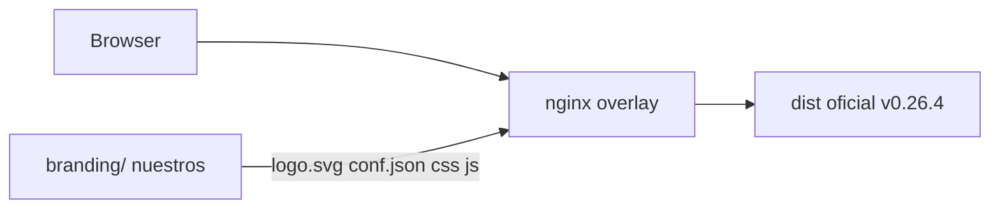

# Branding cosmético LedgerLens (agenda)

Chrome LedgerLens sobre RAGFlow **v0.26.4** self-host, **sin** editar `vendor/ragflow-docker/` y **sin** rebuild de `infiniflow/ragflow`. Demo académico/portfolio: se ve LedgerLens; el motor sigue siendo RAGFlow (Apache-2.0), con atribución visible.

No hay white-label no-code. Maintainer aprobó cambiar logo/nombre ([issue 6740](https://github.com/infiniflow/ragflow/issues/6740)). Dump Parallel: `research/ragflow-whitelabel.json`.

## Quick path (cuando se retome)

1. Confirmá que el pin sigue en **v0.26.4** (`vendor/PIN.md`). Si se refresca el tag, re-extraer hashes de JS (capa C).
2. Implementar capas A → B → D → E. Capa C solo si login/home/search todavía gritan “RAGFlow”.
3. Recrear `ragflow-cpu` con el overlay (`docker compose … up -d`). No hace falta rebuild de imagen.
4. Checklist visual abajo + `./scripts/check.sh` (añadir contratos de `branding/` al implementar).

## Details

| Tema | Decisión |
|------|----------|
| Disparador | Querés chrome LedgerLens en la UI (portfolio / defensa) |
| Fuera de alcance | Rebuild de la imagen oficial, UI propia, editar vendor |
| GitHub / docs del header | **Dejarlos visibles** (honesto) |
| Atribución | Pie: `Motor: RAGFlow v0.26.4 (Apache-2.0)` |
| Logo | SVG en `branding/web/logo.svg`. Si no hay asset: placeholder tipográfico “LL” |
| Dump | `research/ragflow-whitelabel.json` |
| Overlay | `docker-compose.overlay.yml` (hoy solo `paddleocr`; Compose merge admite volumes en `ragflow-cpu`) |
| Nginx en el contenedor | `/etc/nginx/conf.d/ragflow.conf` (= `vendor/ragflow-docker/nginx/ragflow.conf.python`) |
| Dist chequeado | contenedor `ledgerlens-ragflow-cpu-1`, 2026-08-15 |

### Evidencia del dist (v0.26.4)

| Archivo en `/ragflow/web/dist` | Qué muestra |
|--------------------------------|-------------|
| `logo.svg` | Logo y favicon (`index.html` usa `/logo.svg` como icon; no hay `favicon.ico`) |
| `conf.json` | `{ "appName": "RAGFlow" }` — el header lo lee con `GET /conf.json` |
| `index.html` | `<title>RAGFlow</title>` + hashes `/entry/js/index-PP2H8OHW.js` |

Wordmarks hardcoded (`children:"RAGFlow"` / `alt:"RAGFlow"`):

- `chunk/js/login-D182qHRw.js` (login admin)
- `chunk/js/index-DvEDllNF.js` / `index-Cyo9dwjV.js` (login usuario + welcome)
- `chunk/js/searching-B2wCkDF2.js` (search)
- `chunk/js/root-layout-BSUUedJp.js` (`alt` del logo)

`locale-es-*.js` / `locale-en-*.js` mencionan RAGFlow en **tips de ayuda**. No parchearlos.

**No** overlayar `index.html` entero: congela esos hashes. Si se refresca el pin, el HTML overlay se rompe.

## Capas (implementación futura)

### A — estáticos (barato, estable)

Montar encima de `/ragflow/web/dist`:

- `branding/web/logo.svg`
- `branding/web/conf.json` → `{ "appName": "LedgerLens" }`

Cubre: icono de pestaña, logo del header, nombre del header.

### B — nginx + CSS/JS nuestros (integrador)

Copia **fuera de vendor** del `ragflow.conf.python`. En `location /` (HTML):

- `gzip off` solo para `text/html` (si no, `sub_filter` no ve el markup).
- `sub_filter` de `</head>` para inyectar `/ledgerlens.css` y `/ledgerlens.js`.
- Montar esos dos archivos al `dist`.

CSS: acentos LedgerLens. **No** ocultar GitHub/docs.

JS: pie de atribución. Opcional: reemplazo de nodos de texto “RAGFlow” → “LedgerLens” en login/home (parche de presentación, no del bundle).

El compose oficial ya documenta el mount (`# - ./nginx/ragflow.conf:/etc/nginx/conf.d/ragflow.conf`). En el overlay, paths relativos a la raíz del repo (el overlay no vive en `vendor/`).

### C — opcional, pin-tied

Copiar del contenedor los 5 JS hasheados, cambiar `children:"RAGFlow"` → `LedgerLens` (y `alt` en root-layout), montarlos. **Solo válidos para v0.26.4.** Al refrescar el pin: re-extraer. No tocar locales.

### D — in-app (cero código)

Dataset `LedgerLens`; asistente con nombre/avatar/prólogo en español; Empty response + Show Quote (ya en el spec).

### E — README

Una línea: UI branded LedgerLens, motor RAGFlow Apache-2.0. `COMPOSE_PROJECT_NAME=ledgerlens` ya nombra el stack.

## Checklist

- [ ] `branding/web/logo.svg` + `conf.json` montados; header y pestaña dicen LedgerLens
- [ ] Overlay `ragflow-cpu` no rompe el profile `paddleocr`
- [ ] Nginx inject CSS/JS; pie de atribución visible
- [ ] Links GitHub / docs del header **siguen visibles**
- [ ] `index.html` oficial **no** está overlayado entero
- [ ] Vendor pin intacto (`vendor/PIN.md`)
- [ ] Contratos en `scripts/check.sh` para `branding/` + overlay
- [ ] (Opcional C) login / welcome / search sin wordmark RAGFlow
- [ ] Dataset/chat in-app nombrados LedgerLens
- [ ] README atribución Apache-2.0

## Next step

Cuando quieras el chrome: capas A y B primero (restart de `ragflow-cpu`). Capa C solo si el wordmark del login/home molesta en captura de portfolio.
