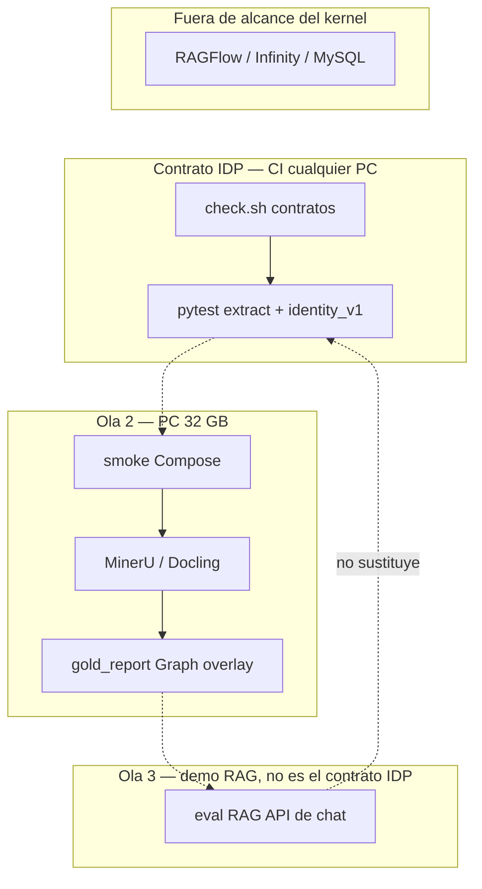
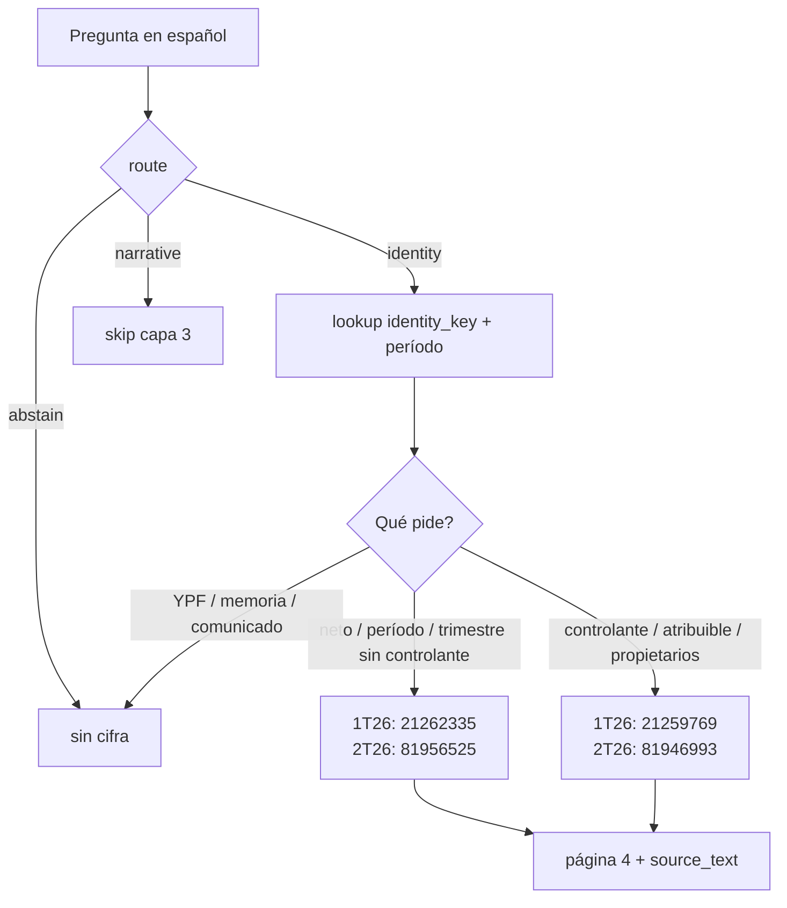
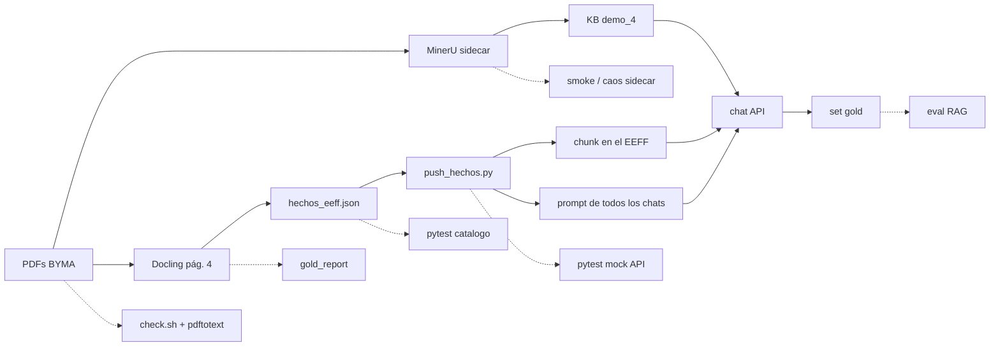
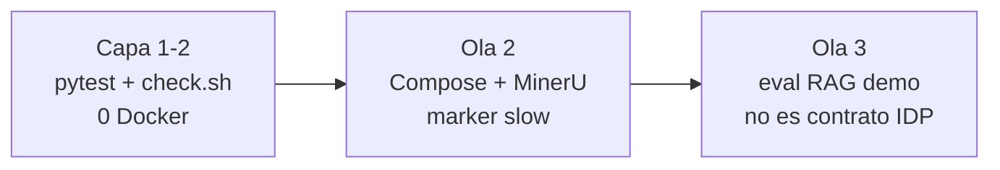
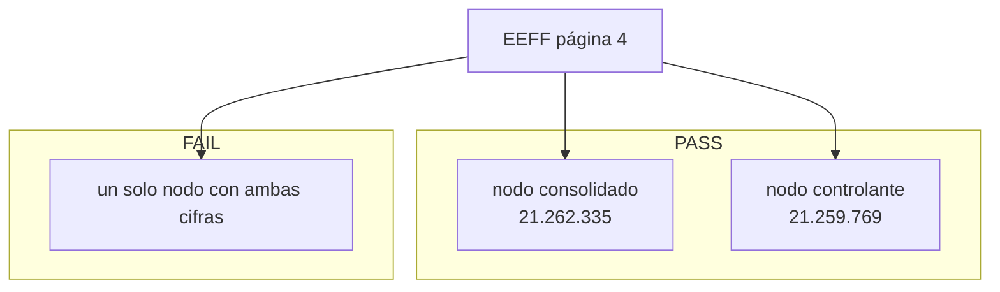
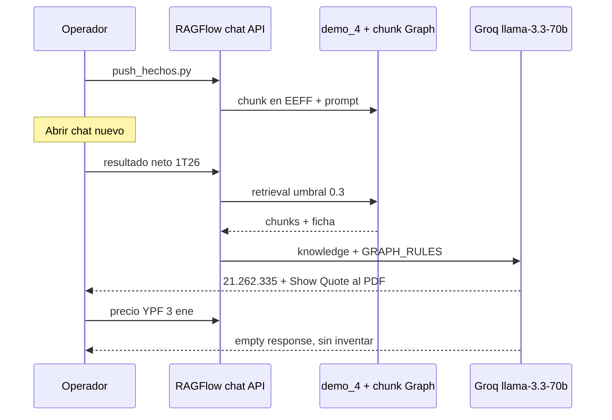

# Mapa de pruebas LedgerLens

El contrato IDP es **capa 2** (extract + lookup, exact-match, sin embeddings). `scripts/check.sh` corre contratos **y** `pytest tests/`. El eval RAG (Ola 3) es del demo `demo_4`; **no** sustituye al kernel.

## Oro (no fusionar)

| Riel | Archivo | Quién lo usa |
|------|---------|--------------|
| Contrato IDP | `recipes/financial_statement.json` + `evals/identity_v1.json` | pytest, `idp_ask.py` |
| Overlay demo | `docs/hechos_eeff.json` | `push_hechos.py` / chat |

Las cifras 1T26/2T26 son las mismas. Los archivos no se mezclan.

Abrí este archivo en preview (`Ctrl+Shift+V`) para ver los diagramas.

## Dónde pega cada capa

Un eval RAG rojo no dice si falló el PDF, el chunk o Groq. Por eso la Ola 3 no reemplaza a capa 1–2.

## Promesa IDP (capa 2)

Estas aserciones son el contrato del kernel. Se miden en `evals/identity_v1.json` + pytest. **Ningún test llama a RAGFlow.**

| Caso | Pregunta | Debe devolver | Debe rechazar |
|------|----------|---------------|---------------|
| 1T26 trampa | ¿Cuál es el resultado neto del período 1T26? | **21262335** | 21259769 y 22362983 |
| 1T26 controlante | ¿Resultado atribuible a la participación controlante 1T26? | **21259769** | el consolidado |
| 2T26 trampa | Resultado neto del período 2T26 (sin decir consolidado) | **81956525** | 81946993 |
| Fuera de corpus | ¿Precio de cierre de YPF en BYMA el 3 de enero? | abstain | cifra inventada |
| Comparación | consolidado 1T26 vs 2T26 | ambas cifras, mismo scope | mezclar controlante |

El demo RAG (Show Quote, empty response, `hechos_eeff.md`) queda en Ola 3; no es el DoD de esta slice.

## Pipeline del demo vs tests

## Olas

Completar de a una. Ola 1 entra en CI de cualquier PC (también la de ~7 GB). Ola 2 y 3 viven en la máquina de 32 GB.

### Capa 1 y 2 — contrato IDP (primero)

pytest sobre `schemas/extract.py`, `schemas/lookup.py` y `evals/identity_v1.json`. Extrae página 4 con `pdftotext -layout`, proyecta dos claims, lookup léxico (default consolidado). Host sin poppler: skip explícito de extract, no fail silencioso. **Sin Docker, sin RAGFlow.**

### Ola 2 — stack vivo

Smoke de Compose, health de MinerU, sidecar caído, `gold_report` de Graph como job opcional. Marker `slow` / `compose`. No en cada push.

### Ola 3 — demo RAG (no es el contrato IDP)

Eval RAG contra la API de chat (no clicks en la UI): trampas consolidado/controlante en el asistente `chat_demo_4`. Un eval rojo no dice si falló el PDF, el chunk o Groq: por eso no sustituye a capa 1–2.

## Criterio Graph: dos nodos, no uno

`gold_report` en pytest (Ola 1, grafo fake) y en vivo (Ola 2, `--preset 1t26` / `2t26`).

## Eval RAG: secuencia

## Catálogo

| Capa | Prueba | Qué rompe si falla | Harness | Costo | Ola | Estado |
|------|--------|--------------------|---------|-------|-----|--------|
| Contratos | Pin vendor, overlay MinerU, `.env.example`, sin `app.py` | Stack pinneado sin apps prohibidas | `scripts/check.sh` | CI, 0 Docker | 1 | Ya corre |
| Contratos | PDFs BYMA ≥6 + comunicado 1T26 contiene BYMA | Fixtures de `docs/archivos_muestra/` | `check.sh` + `pdftotext` | CI, 0 Docker | 1 | Ya corre |
| Contratos | `bash -n` de todos los scripts + overlay sin `:8080` PaddleOCR | `up.sh` no eval; PaddleOCR no publica host | `check.sh` ampliado | CI, 0 Docker | 1 | Manual / incompleto |
| Contratos | Catálogo JSON + nombres de PDF coinciden con `archivos_muestra` | Fichas Graph apuntan a un filing que no existe | `pytest tests/test_catalog_files.py` | CI, 0 Docker | 1 | No existe |
| Unitarios | IDP extract + identity lookup + `evals/identity_v1.json` | Fila vecina / período mezclado / YPF no abstiene | `pytest tests/` vía `check.sh` | CI + poppler | 1–2 | Ya corre |
| Unitarios | `needs_graph`: EEFF sí; memoria/comunicado/presentación no | Graph corre sobre Memorias (OOM) o sobre no-P&L | `pytest tests/test_graph_hechos.py` | CI, 0 Docker | 1 | No existe |
| Unitarios | `Monto.strip_thousands` y `format_ars` (21.262.335 ↔ 21262335) | La plantilla redondea o pierde dígitos | `pytest tests/test_eeff_byma.py` | CI, 0 Docker | 1 | No existe |
| Unitarios | `ficha_chunk` + `upsert_graph_prompt` (idempotente, no cita `.md`) | Show Quote cita markdown auxiliar; re-push duplica el bloque | `pytest tests/test_graph_hechos.py` | CI, 0 Docker | 1 | No existe |
| Unitarios | `gold_report` con grafo fake: PASS dos nodos / FAIL mismo nodo | Criterio de merge 1T26/2T26 no es ejecutable sin Groq | `pytest tests/test_gold_report.py` | CI, 0 Docker | 1 | No existe |
| Golden PDF | `pdftotext` del EEFF contiene consolidado y controlante del catálogo | El oro vive solo en `docs/hechos_eeff.json` | `pytest tests/test_eeff_gold_pdf.py` | CI + poppler | 1 | No existe |
| Golden PDF | `no_usar` (22.362.983) no se elige como consolidado 1T26 | Columna del ejercicio anterior | pytest + `ficha_chunk` extra | CI, 0 Docker | 1 | No existe |
| Smoke Compose | `up.sh`: UI `:80`, `mineru-api` healthy, `paddleocr` apagado | Arranque default del stack | `scripts/smoke_compose.sh` (marker ≥16 GB) | ≥16 GB + Docker | 2 | Manual / incompleto |
| Smoke Compose | `max_map_count` bajo → fail fast, no dice demo ready | `up.sh` afirma listo con Infinity roto | test de `up.sh` con mock `/proc` o skip en CI | CI o VM | 2 | No existe |
| Parser | MinerU `POST /file_parse` sobre 1 página de un comunicado | Ingest default no llama al sidecar | `pytest -m mineru` (stack up) | ≥16 GB + sidecar | 2 | No existe |
| Parser | Sidecar caído → ingest falla visible, sin texto inventado | Parser down fabrica texto | `docker stop mineru-api` + intento de parse | ≥16 GB, caos | 2 | No existe |
| Parser | Docling página 4, OCR off, dígitos gold en la tabla | Overlay Graph OOM o rompe RapidOCR | `pytest -m docling` | CPU local, lento | 2 | Manual / incompleto |
| Graph | `gold_report` 1T26 y 2T26: dos nodos distintos | Criterio de merge de `docs/agenda/docling-graph.md` | `run_docling_graph_eeff.py --preset` (existe, no en CI) | Groq overlay + CPU | 2 | Manual / incompleto |
| Graph | `push_hechos`: chunk solo en PDFs `needs_graph`; prompt en todos los chats | Reparsea MinerU o toca comunicados | pytest con HTTP mock de `/api/v1` | CI, 0 Docker | 1 | No existe |
| RAG eval | In-corpus: resultado neto 1T26 → 21.262.335 + cita + español | Respuesta sin evidencia o cifra de al lado | RAGFlow chat API + golden set | stack + Groq + Voyage | 3 | Manual / incompleto |
| RAG eval | Out-of-corpus: precio YPF 3 ene → empty response, sin inventar | Alucinación | RAGFlow chat API | stack + Groq + Voyage | 3 | Manual / incompleto |
| RAG eval | Controlante explícito 1T26 → 21.259.769, no 21.262.335 | Graph no desambigua la fila de al lado | chat API post-`push_hechos`, chat nuevo | stack + Groq + Voyage | 3 | No existe |
| RAG eval | Empty response del asistente no está en blanco | `knowledge-qa`: Blank Empty response forbidden | GET chat assistant config | stack + API token | 3 | No existe |
| RAG eval | Show Quote cita el PDF del EEFF, no `hechos_eeff.md` | `GRAPH_RULES` ignorada | inspección de referencias del completion | stack + Groq | 3 | No existe |
| Seguridad | `.env` gitignored; `check.sh` rechaza `gsk_` / `AIza` en `.env.example` | Keys en git | `check.sh` | CI, 0 Docker | 1 | Ya corre |
| Resiliencia | `push_hechos` dos veces no duplica el bloque Graph | `upsert_graph_prompt` no es idempotente en vivo | pytest mock + 1 corrida live opcional | CI / stack | 2 | No existe |

Host probe de RAM / Docker / Ollama en `check.sh` debe seguir siendo **SKIP**, no FAIL, para no romper CI en la PC de 7 GB.

## Detalle por tipo

### Contratos estáticos (`check.sh`)

Ya cubre pin v0.26.4, overlay MinerU, keys comentadas, PDFs de muestra y `bash -n scripts/up.sh`. Ampliar con:

- `bash -n` de Graph / push
- overlay sin publicar `:8080` en PaddleOCR
- `docs/hechos_eeff.json` parseable
- alineación README ↔ `.env.example` (`MINERU_APISERVER`, Groq, empty response)

### Unitarios del overlay Graph

`needs_graph`, `format_ars`, `ficha_chunk`, `upsert_graph_prompt` y el validador `Monto` son lógica pura. Un mock HTTP cubre que `push_hechos.py` solo adjunta chunk a filings EEFF. `gold_report` se testea con un grafo de juguete: dos nodos con dígitos distintos = PASS; un solo nodo con ambos montos = FAIL.

### Golden del PDF vs catálogo

`pdftotext -layout` sobre los dos EEFF debe encontrar los pares del JSON. Si alguien reemplaza un filing, el test falla antes del chat. También asertar que `22.362.983` aparece como `no_usar` y que Graph no lo elige como consolidado.

### Smoke Compose y parser

Job aparte: `scripts/up.sh`, curl a `:80`, health de `mineru-api`, `docker compose ps` sin `paddleocr`, y un `POST /file_parse` de una página. Caos: stop del sidecar y comprobar que el ingest de RAGFlow falla a la vista. Docling página 4 sin OCR es el puente al overlay; no hace falta parsear las 81 páginas.

### Eval RAG

No hace falta Playwright contra la UI. Un script con token RAGFlow manda las preguntas gold y aserta: idioma, cifra exacta, presencia de referencia, y copy de empty response.

Flaky por diseño: Groq y retrieval no son deterministas. La aserción tiene que ser **dígitos + empty-copy**, no igualdad de párrafo. Umbral de rerank **0.3** es parte del fixture.

### Qué se difiere

Performance de parse 1800 s, carga de Memoria anual, UI visual, tests internos de Infinity / MySQL / MinIO. Groq 429 → el operador cambia a Ollama a mano; no hay failover automático que testear.

## Orden recomendado

1. `uv venv && uv pip install -r requirements-dev.txt` y `./scripts/check.sh` (capa 1–2).
2. Smoke Compose + MinerU + `gold_report` en la PC de 32 GB (Ola 2).
3. Eval RAG de las cinco filas gold del demo (Ola 3; no es el contrato IDP).
