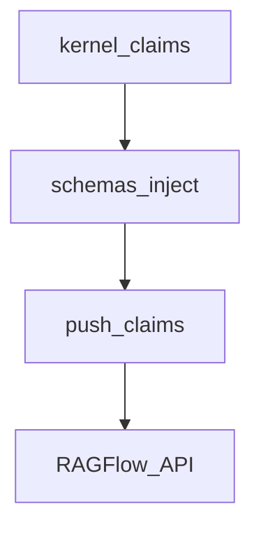

# Design: Inject identity claims into RAGFlow

## Technical Approach

Keep the existing RAGFlow chunk + prompt_config HTTP path. Swap the payload source from Graph JSON to `Claim` tuples. Pure formatting lives in `schemas/inject.py` so pytest needs no network.

## Architecture Decisions

| Decision | Choice | Rejected | Why |
|----------|--------|----------|-----|
| Source | Kernel claims | `hechos_eeff.json` | Duplicate gold |
| Chunk target | Dedicated EEFF only | All docs | Show Quote must cite the filing |
| Prompt | All claims by period | EEFF-only prompt | Press/presentation ride along later |
| Graph | Delete extractor | Keep as fallback | IDP already extracted |
| Pin | Unchanged | Inflate ragflow change | Vendor pin is UI/stack |

## Data Flow

## File Changes

| File | Action |
|------|--------|
| `schemas/inject.py` | Create: markers, format, chunk, prompt upsert |
| `scripts/push_claims.py` | Create: HTTP inject |
| `scripts/push_hechos.py` | Alias to `push_claims.main` |
| Graph scripts, templates, hechos_eeff, graph agenda | Delete |
| README, testing, handoff | Inject from claims; mandatory push after merge |

## Testing Strategy

| Layer | What |
|-------|------|
| Unit | Chunk text, upsert strips Graph, format ARS |
| Integration | Mock urllib for POST/DELETE |
| E2E | Manual ≥16 GB (not CI) |

## Threat Matrix

HTTP to local RAGFlow with bearer token (existing pattern). Argv/docker exec unchanged from prior push script. Tests MUST NOT hit a live host.

## Migration / Rollout

On the UI host: `python scripts/push_claims.py` after merge; open a **new** chat. Until then old Graph chunks may remain.

## Open Questions

None.
