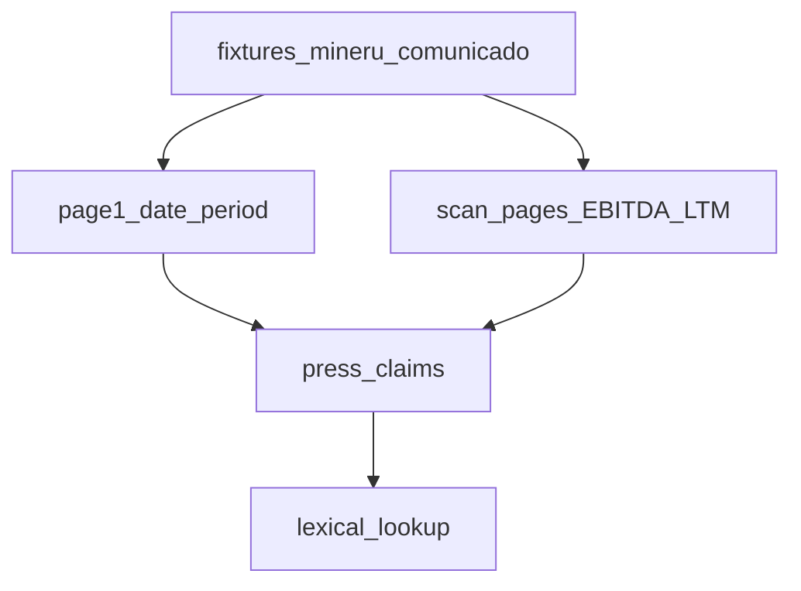

# Design: Press-release EBITDA LTM margin

## Technical Approach

Keep date/period on the cover page. After that, walk MinerU pages for a single LTM percentage. Identity lookup stays lexical. RAGFlow (Voyage, Infinity, Groq) is still chat-only.

## Architecture Decisions

| Decision | Choice | Rejected | Why |
|----------|--------|----------|-----|
| Where | Existing press plugin | New recipe / embeddings | Same PDF, same classify |
| Page | Scan artifact pages | Only page 1 | The line is on page 2 |
| Bare EBITDA | Abstain | Map to 76 | Press also has millions; ambiguous |
| Cross-check | Pytest values equal | New compare route across scopes | Lookup compare is same metric+scope |
| Chat | prompt_lines already lists all claims | Fatten push_claims | Do not inflate inject |

## Data Flow

## File Changes

| File | Action |
|------|--------|
| `schemas/claim.py`, `press_release.py`, `lookup.py` | Metric + extract + route |
| `recipes/press_release.json`, `evals/press_v1.json` | Gold |
| tests + HITL example keys | 24 verdicts |
| README, testing, handoff, plan-siguiente | Pointers |

## Testing Strategy

Unit extract vs recipe gold. Lookup: LTM del comunicado ≠ neto ≠ presentation_ebitda. Cross: press `76` == deck `76`. identity_v1/v2 abstain regression unchanged.

## Threat Matrix

No new subprocess. Regex over MinerU text only.
