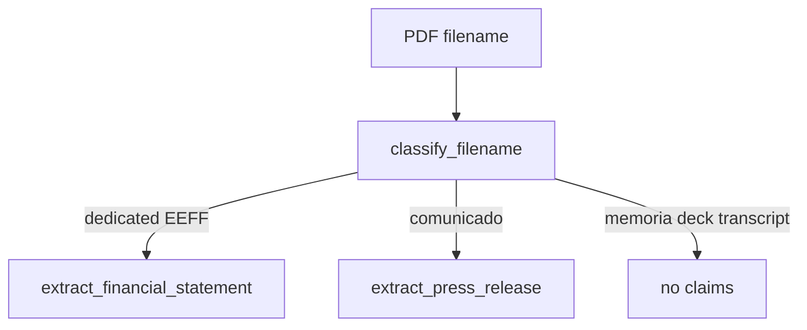

# Design: Press-release identity plugin

## Technical Approach

Add a second extract plugin beside finance. Classification grows one filename heuristic. `extract_financial_statement` stays EEFF-only. `extract_claims_from_dir` dispatches.

## Architecture Decisions

| Decision | Choice | Rejected | Why |
|----------|--------|----------|-----|
| Domain | `press_release` | `legal_contract` | Real PDFs in `docs/archivos_muestra/` |
| Fields | announcement date + reporting period | Neto/impuesto/ingresos of the PR table | Millions ≠ EEFF thousands; evals already abstain those questions |
| Scope in Claim | `comunicado` | Reuse `consolidado` | Finance lookup must not pick press claims |
| Page | 1 via recipe keywords | Whole PDF | Date and 1T26/2T26 sit on page 1 |

## Data Flow

## File Changes

| File | Action |
|------|--------|
| `openspec/changes/claimprint-press-release/` | Create SDD |
| `recipes/press_release.json` | `extract: true`, schema, keywords, gold |
| `schemas/press_release.py` | DTO + fill + claims |
| `schemas/classify.py` | `comunicado` → `press_release` |
| `schemas/corpus.py` | Dispatch |
| `schemas/lookup.py` | Press intent after EEFF+comunicado abstain |
| `evals/press_v1.json` + `tests/test_evals_press.py` | Gold |
| README, handoff, plan-siguiente-idp | Pointers |

## Testing Strategy

| Layer | What |
|-------|------|
| Unit | classify comunicado vs EEFF vs memoria |
| Integration | pdftotext page 1 vs recipe gold |
| Eval | press_v1 + identity_v1/v2 abstain traps |

## Threat Matrix

No new subprocess. `pdftotext` path unchanged (`shell=False`).

## Rollback

Git revert this change. Finance plugin and claim-store remain.
