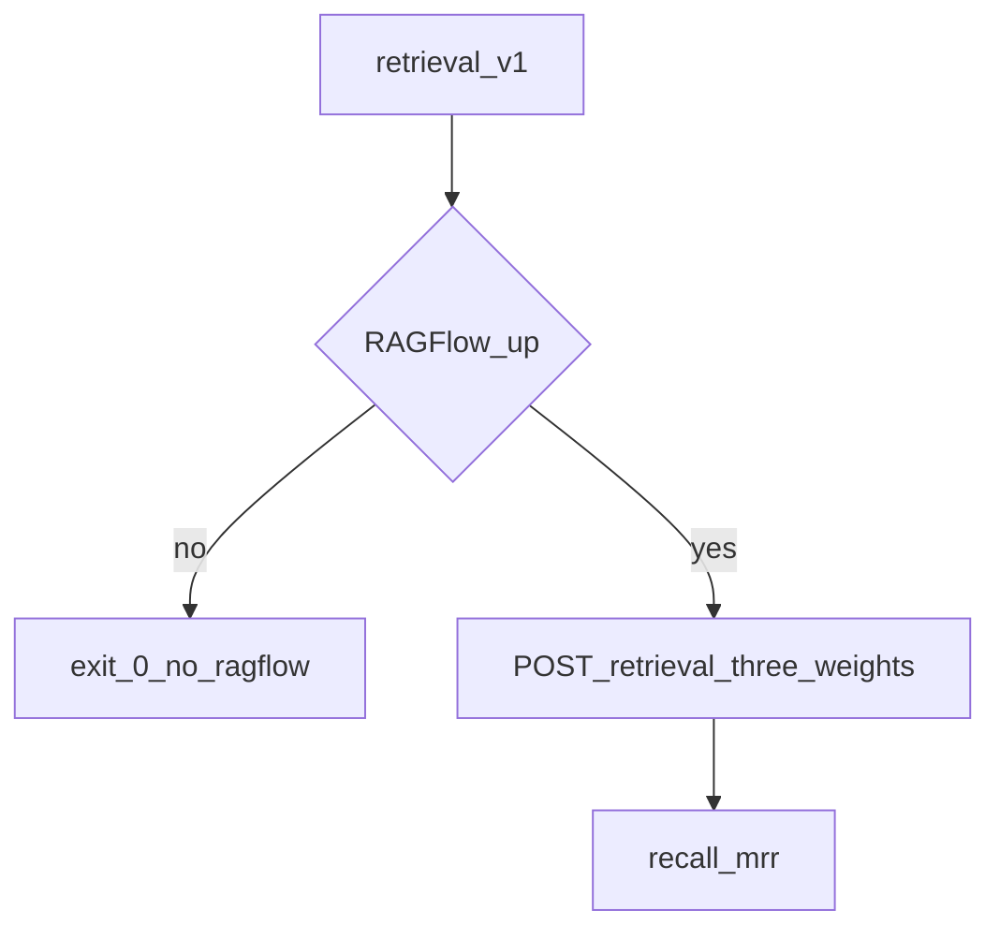

# Design: RAG retrieval pilot

## Technical Approach

Keep identity pytest gold-first and offline. Add a second eval track whose live half is optional. Metrics are pure functions over ranked `{doc, page}` lists.

## Architecture Decisions

| Decision | Choice | Rejected | Why |
|----------|--------|----------|-----|
| Qrel unit | PDF filename + page | identity_key | Retrieval finds chunks, not typed claims |
| Arms | weight 0 / 1 / 0.3, rerank off | Whoosh; BM25 library | Same KB; knobs only |
| Label | keyword / vector / hybrid | Okapi BM25 / RRF | Thesis wording; RAGFlow keyword is TF-IDF |
| CI | skip without stack | Fail closed | 7 GB notebook |
| Chat gold | 10 cases | Reuse identity_v1 as retrieval | Different layer |

## Data Flow

## Testing Strategy

Unit tests feed fake rankings. Scripts must not use `shell=True`. `check.sh` asserts files exist and pytest stays offline.

## Threat Matrix

HTTP client uses urllib + Bearer token like `push_claims.py`. No new subprocess shell strings.
