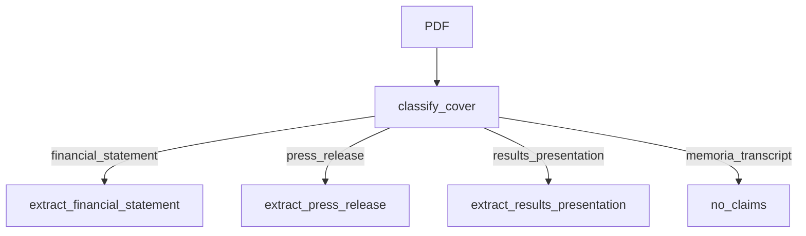

# Design: Results-presentation identity plugin

## Technical Approach

Third extract plugin beside finance and press. Classification: cover `presentación de resultados`. Extract from MinerU highlights via recipe keywords. Lookup handles presentation intent before narrative.

## Architecture Decisions

| Decision | Choice | Rejected | Why |
|----------|--------|----------|-----|
| Fields | EBITDA + LTM margin | Slide-2 P&L; date-only; AUC | Unique, stable in fixtures; P&L units lie |
| Scope | `presentacion` | Reuse consolidado | Finance lookup must not pick deck amounts |
| Page | Highlights `Alcanzamos un EBITDA` | Page 1 or RESULTADO TRIMESTRAL | Page 12 in current fixtures |
| As-of date | Out | Include | Duplicates press 8-may / 7-ago |

## Data Flow

## File Changes

| File | Action |
|------|--------|
| `schemas/results_presentation.py` | DTO + fill + claims |
| `recipes/results_presentation.json` | extract true, gold, keywords |
| `schemas/classify.py` | Deck cover → recipe |
| `schemas/lookup.py` | Presentation intent + abstain |
| `schemas/corpus.py` | Dispatch |
| `evals/presentation_v1.json` | Gold |
| tests + check.sh + README trap line | |

## Testing Strategy

| Layer | What |
|-------|------|
| Unit | classify deck vs memoria vs transcript |
| Integration | fixtures vs recipe gold; no FS from deck |
| Eval | presentation_v1 + v1/v2/press regression |

## Threat Matrix

N/A — no new subprocess.

## Migration / Rollout

On ≥16 GB: `python scripts/push_claims.py` after extract so EBITDA appears in chat prompt.

## Open Questions

None.
