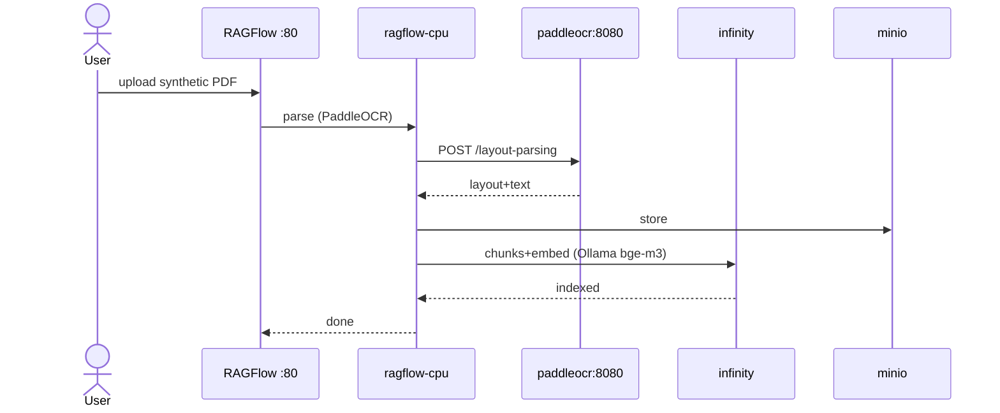
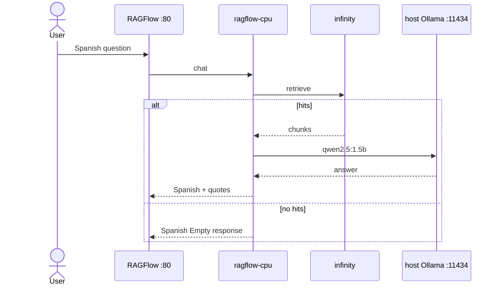

# Design: LedgerLens RAGFlow local stack

Vendor official RAGFlow `docker/` **v0.26.4** + overlay: CPU PaddleOCR on network `ragflow`, host Ollama for chat/embed. No `app.py`, `ledger_lens/`, Gradio, HF Space. Ignore leftover `openspec/changes/ledger-lens-mvp/`. Specs may land in parallel (`document-parse`, `knowledge-qa`, `local-stack`, `portfolio-local`).

## Technical Approach

`scripts/up.sh` starts official compose + overlay. RAGFlow UI **:80** is the product. Parser is remote PaddleOCR; LLM stays on the host. First-run KB/chat (Spanish, Empty response, Show Quote) lives in README, not code.

## Architecture Decisions

| Decision | Choice | Rejected | Why |
|----------|--------|----------|-----|
| Stack shape | Vendor `docker/` v0.26.4 + overlay | Submodule; from-scratch compose | Keeps MySQL/MinIO/Redis/Infinity, `extra_hosts`, CPU profile |
| Doc engine | `DOC_ENGINE=infinity` (`COMPOSE_PROFILES=infinity,cpu`) | Elasticsearch / OpenSearch | Lower RAM; official switch. Not Linux/arm64 |
| OCR | CPU `PP-StructureV3` → `POST /layout-parsing` | VL default; AI Studio token | Fits 16 GB with RAGFlow + Ollama; VL optional via env |
| OCR URL | `http://paddleocr:8080/layout-parsing` | FAQ `localhost:8080`; host-only OCR | `localhost` inside RAGFlow is the container |
| LLM | Host Ollama `http://host.docker.internal:11434` | Compose `ollama` | Official local-LLM path; `OLLAMA_HOST=0.0.0.0` |
| Embed | Ollama `bge-m3` | `tei-cpu` / Qwen3-Embedding | TEI RAM too high; RAGFlow image has no embeddings |
| Chat model | `qwen2.5:1.5b` | 7B+ in-compose | RAM budget |

## Data Flow





## File Changes

| File | Action | Description |
|------|--------|-------------|
| `vendor/ragflow-docker/` | Create | Pin `infiniflow/ragflow` `docker/` v0.26.4 (Apache-2.0) |
| `vendor/PIN.md` | Create | Tag, source URL, do-not-edit-upstream |
| `docker-compose.overlay.yml` | Create | `paddleocr` on `ragflow`; do not publish 8080 |
| `docker/paddleocr/Dockerfile` | Create | `paddlex --serve --pipeline PP-StructureV3 --device cpu --host 0.0.0.0 --port 8080` |
| `.env.example` | Create | Infinity, `RAGFLOW_IMAGE=infiniflow/ragflow:v0.26.4`, Compose-DNS PaddleOCR URL/algorithm; no token |
| `scripts/up.sh` | Create | Read-only `vm.max_map_count` ≥ 262144; sync `.env` → vendor; compose both files; `ollama pull qwen2.5:1.5b` + `bge-m3` |
| `README.md` | Create | x86_64, ≥16 GB, Docker ≥24, Compose ≥v2.26.1; `OLLAMA_HOST=0.0.0.0`; Empty response + Show Quote; synthetic-only |
| `examples/synthetic/*.pdf` | Create | 3–4 Spanish fake financial PDFs |
| `.gitignore` | Modify | Keep `.env`; ignore vendor `.env` and `ragflow-logs/` |

Do **not** create: `app.py`, `ledger_lens/`, Gradio, HF Space, Compose Ollama, TEI, Elasticsearch.

## Interfaces / Contracts

```bash
docker compose --env-file .env \
  -f vendor/ragflow-docker/docker-compose.yml \
  -f docker-compose.overlay.yml up -d
```

Vendor relative paths stay valid. Overlay `build: ./docker/paddleocr` is repo-root-relative. Same project merges `ragflow`. Sync `.env` into vendor because official `env_file: .env`.

| Contract | Value |
|----------|--------|
| UI | `http://localhost` (`SVR_WEB_HTTP_PORT=80`) |
| OCR | DNS `paddleocr`; `POST /layout-parsing`; no access token |
| LLM | `http://host.docker.internal:11434` (never container `127.0.0.1`) |
| Empty response | Non-blank Spanish no-evidence line (copy owned by spec) |

## Testing Strategy

No runner (`strict_tdd: false`). Smoke only on ≥16 GB x86 + Docker 24+ (this host ~7.4 GB, no Docker).

| Layer | What | Approach |
|-------|------|----------|
| Unit | N/A | No app package |
| Integration | UI :80, PaddleOCR, Ollama tags | `curl` / `compose ps` / `ollama list` |
| E2E | Parse PDFs; cite; no-evidence | Manual per README |

## Threat Matrix

`up.sh` is an explicit shell entrypoint (compose + `ollama pull` + sysctl **read**). Not VCS/PR automation.

| Boundary | Applicability | Design response | Planned RED tests |
|----------|---------------|-----------------|-------------------|
| Documentation-like paths | N/A: does not execute README/`requirements.txt`/MDX | — | none |
| Git repository selection | N/A: no git | — | none |
| Commit state | N/A: no commits | — | none |
| Push state | N/A: no push | — | none |
| PR commands | N/A: no `gh` | — | none |

`up.sh` must not `eval` user strings, must not `sysctl -w` unless documented, must not publish `:8080`.

## Migration / Rollout

No migration. Rollback: `docker compose down -v`; git revert overlay/vendor/env/scripts/fixtures. Host Ollama remains.

## Open Questions

- [ ] Exact Spanish Empty-response string — spec owns; design requires non-blank.
- [ ] PaddleOCR image digest — pin at apply (CPU PaddlePaddle 3.x + `paddlex[serving]`).
