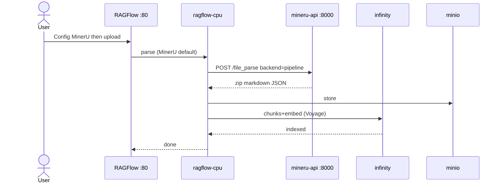
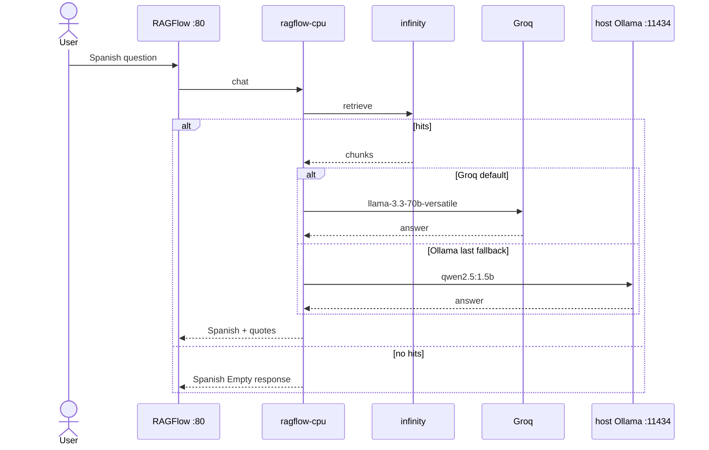

# Design: LedgerLens RAGFlow local stack

Vendor official RAGFlow `docker/` **v0.26.4**. Default parser **MinerU** `pipeline` (sidecar CPU `mineru-api:8000`). Naive/DeepDoc fallback. Optional PaddleOCR overlay (Compose profile `paddleocr`). Default chat: **Groq** `llama-3.3-70b-versatile`. Embed: **Voyage**. Host Ollama is last fallback. Infinity for lower RAM. No `app.py`, `ledger_lens/`, Gradio, HF Space, LiteLLM sidecar.

## Technical Approach

`scripts/up.sh` starts official compose (overlay file loaded; `paddleocr` service idle unless profile enabled). RAGFlow UI **:80** is the product. First-run KB/chat (Spanish, Empty response, Show Quote, Groq `llama-3.3-70b-versatile`) lives in README, not code. Deferred items live in `docs/agenda/`. Host-level checks: `scripts/check.sh`.

## Architecture Decisions

| Decision | Choice | Rejected | Why |
|----------|--------|----------|-----|
| Stack shape | Vendor `docker/` v0.26.4 + optional overlay | Submodule; from-scratch compose | Keeps MySQL/MinIO/Redis/Infinity, `extra_hosts`, CPU profile |
| Doc engine | `DOC_ENGINE=infinity` (`COMPOSE_PROFILES=infinity,cpu`) | Elasticsearch / OpenSearch | Lower RAM; official switch. Not Linux/arm64 |
| PDF parser | **MinerU** `pipeline` sidecar (`MINERU_APISERVER=http://mineru-api:8000`) | Docling Serve as default; Naive as default; PaddleOCR as default; MinerU hybrid; Granite-Docling VLM | EEFF BYMA need layout + tables ([Select PDF parser](https://ragflow.io/docs/dev/select_pdf_parser)). RAGFlow v0.26.4 Docling client drops `page_range` (#17450). Hybrid/VLM need NVIDIA. Naive/DeepDoc remain fallback |
| Optional OCR | Profile `paddleocr` + commented env | Always-on PaddleOCR | Keep PaddleOCR as an alternate parser without paying RAM at boot |
| OCR URL (when enabled) | `http://paddleocr:8080/layout-parsing` | FAQ `localhost:8080` | `localhost` inside RAGFlow is the container |
| LLM | Groq default (`llama-3.3-70b-versatile`); Ollama last fallback | LiteLLM sidecar; OpenRouter Nano `:free` as default; Gemini flash-lite as default; Compose `ollama`; vLLM now | Live `chat_demo_4` uses Groq. Nano `:free` hit daily quota. Gemini was documented but not the running assistant. Voyage stays native. |
| Embed | Voyage native in RAGFlow (`voyage-finance-2`) | LiteLLM Voyage; OpenRouter embed; TEI; Ollama `bge-m3` | v0.22+ image has no built-in embeddings; `demo_4` already indexed with native Voyage |
| Chat model | `llama-3.3-70b-versatile` | OpenRouter Nano `:free`; Gemini `gemini-3.1-flash-lite`; 7B+ in-compose | Groq factory in Model providers; Ollama `qwen2.5:1.5b` is last fallback |

## Data Flow





## File Changes

| File | Action | Description |
|------|--------|-------------|
| `vendor/ragflow-docker/` | Create | Pin `infiniflow/ragflow` `docker/` v0.26.4 (Apache-2.0) |
| `vendor/PIN.md` | Create | Tag, source URL, do-not-edit-upstream |
| `docker-compose.overlay.yml` | Create | MinerU API CPU (`mineru-api:8000`); optional `paddleocr` (profile); do not publish 8080 |
| `docker/mineru/Dockerfile` | Create | CPU `mineru[pipeline]==3.4.5`; `mineru-api --host 0.0.0.0 --port 8000` |
| `docker/paddleocr/Dockerfile` | Create | `paddlex --serve --pipeline PP-StructureV3 --device cpu --host 0.0.0.0 --port 8080` |
| `.env.example` | Create | Infinity, `RAGFLOW_IMAGE=infiniflow/ragflow:v0.26.4`; `MINERU_APISERVER` + `MINERU_BACKEND=pipeline`; `GROQ_API_KEY` commented; PaddleOCR vars commented |
| `scripts/up.sh` | Create | Read-only `vm.max_map_count` ≥ 262144; sync `.env` → vendor; compose both files; optional `ollama pull qwen2.5:1.5b` fallback |
| `scripts/check.sh` | Create | File contracts, PDF fixtures, host probe |
| `docs/agenda/` | Create | Applied: MinerU pipeline. Deferred: Graph, vLLM, LinkedIn, branding |
| `README.md` | Create | x86_64, ≥16 GB, Docker ≥24, Compose ≥v2.26.1; `OLLAMA_HOST=0.0.0.0`; Empty response + Show Quote; BYMA samples |
| `docs/archivos_muestra/` | Create | BYMA sample financial PDFs (comunicados, EEFF, presentaciones, memoria) |
| `.gitignore` | Modify | Keep `.env`; ignore vendor `.env` and `ragflow-logs/` |

Do **not** create: `app.py`, `ledger_lens/`, Gradio, HF Space, Compose Ollama, TEI as default, Elasticsearch.

## Interfaces / Contracts

```bash
docker compose --env-file .env \
  -f vendor/ragflow-docker/docker-compose.yml \
  -f docker-compose.overlay.yml up -d
```

Vendor relative paths stay valid. Overlay `build: ./docker/paddleocr` is repo-root-relative. Same project merges `ragflow`. Sync `.env` into vendor because official `env_file: .env`.

| Contract | Value |
|----------|--------|
| UI | `http://localhost` (`SVR_WEB_HTTP_PORT=80`) |
| OCR | MinerU `pipeline` default (sidecar :8000 `POST /file_parse`); Naive/DeepDoc fallback; optional DNS `paddleocr` + `POST /layout-parsing` |
| LLM | Groq `llama-3.3-70b-versatile`; Ollama last fallback; Voyage embed stays native in RAGFlow |
| Empty response | Non-blank Spanish no-evidence line (copy owned by spec) |

## Testing Strategy

No runner (`strict_tdd: false`). Smoke only on ≥16 GB x86 + Docker 24+ Compose v2 (this host ~7.4 GB; Docker CLI installed, no `docker` group, no Compose plugin).

| Layer | What | Approach |
|-------|------|----------|
| Unit | N/A | No app package |
| Integration | UI :80; Groq in UI; Ollama last fallback tag | `scripts/check.sh`; `curl` / `compose ps` on ≥16 GB |
| E2E | Parse PDFs; cite; no-evidence | Manual per README |

## Threat Matrix

`up.sh` is an explicit shell entrypoint (compose + `ollama pull` + sysctl **read**). Not VCS/PR automation.

| Boundary | Applicability | Design response | Planned RED tests |
|----------|---------------|-----------------|-------------------|
| Documentation-like paths | N/A: does not execute README/`requirements.txt`/MDX | — | none |
| Git repository selection | N/A: no git | — | none |
| Commit state | N/A: no commits | — | none |
| Push state | N/A: no push | — | none |
| PR commands | N/A: no `gh` | — | none |

`up.sh` must not `eval` user strings, must not `sysctl -w` unless documented, must not publish `:8080`.

## Migration / Rollout

No migration. Rollback: `docker compose down -v`; git revert overlay/vendor/env/scripts/fixtures. Host Ollama remains.

## Open Questions

- [ ] Exact Spanish Empty-response string — spec owns; design requires non-blank.
- [ ] PaddleOCR image digest — pin at apply (CPU PaddlePaddle 3.x + `paddlex[serving]`).
