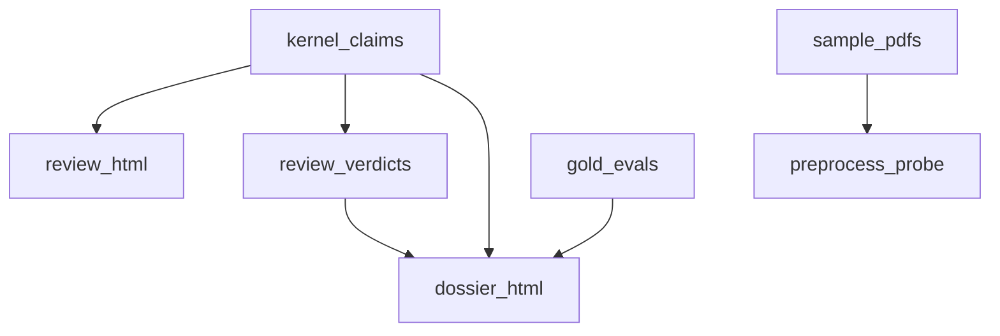

# Design: Academic close

## Technical Approach

Keep extract, lookup, and RAGFlow inject unchanged. Add a verdict layer in front of the academic HTML export. Orientation probe is a separate desktop script that never runs in `check.sh` pytest as a hard requirement.

## Architecture Decisions

| Decision | Choice | Rejected | Why |
|----------|--------|----------|-----|
| HITL volume | Review all ~22 identity claims | Confidence queue | Academic corpus is tiny; finance figures are high-risk |
| Missing verdicts | Accept-all | Fail closed | Notebook CI has no human |
| Dossier gold | Eval `identity` + `abstain` | Include `narrative` | Narrative is chat capa 3 |
| Paddle | Cover orientation only | UVDoc; PP-OCRv6 as SoT | Native BYMA PDFs; MinerU stays identity parse |
| Hybrid BM25 | Document Infinity defaults | New Python BM25 index | Engine already hybrid; Okapi would duplicate gold |
| HTML | Inline CSS, `outputs/` | Custom UI; committed PDF | No product UI; outputs gitignored |

## Data Flow



## File Changes

| File | Action |
|------|--------|
| `openspec/changes/ledgerlens-academic-close/` | Create SDD |
| `schemas/review.py` | Verdict load/filter |
| `schemas/dossier.py` | HTML builders |
| `scripts/review_pack.py` | Review HTML CLI |
| `scripts/informe.py` | Dossier CLI |
| `scripts/preprocess_probe.py` | Optional orientation |
| `examples/review_verdicts.example.json` | All-accept keys |
| tests | review, informe, preprocess skip |
| docs + `check.sh` + openspec pointers | Close narrative |

## Interfaces / Contracts

```text
Verdict: accept | reject | flag
load_verdicts(path) -> dict[identity_key, verdict]
publishable(claims, verdicts) -> claims with accept (or missing key)
flagged(claims, verdicts) -> flag rows
render_dossier(claims, verdicts, eval_cases) -> html str
preprocess_probe(pdfs) -> {skipped?, rows: [{name, angle, reason?}]}
```

## Testing Strategy

| Layer | What | Approach |
|-------|------|----------|
| Unit | accept-all, reject hidden, flag annex | pytest, fake claims, no Paddle |
| Informe | 1T26 neto in HTML when fixtures present | pytest + MinerU fixtures |
| Preprocess | import/skip without paddle | pytest skip; no Docker |
| Eval | identity_v1/v2/press/presentation | unchanged |
| E2E chat | hybrid weights | manual ≥16 GB |

## Threat Matrix

`preprocess_probe.py` may spawn `pdftoppm` with argv list (`shell=False`). PDF path is a Path from the sample dir, not interpolated.

| Boundary | Applicability | Design response |
|----------|---------------|-----------------|
| Subprocess | pdftoppm argv list | `shell=False`; no user string eval |
| Git | outputs MUST stay ignored | example JSON under `examples/` |

## Migration / Rollout

Notebook: generate review HTML + dossier. Desktop: optional Paddle; `push_claims` + new chat. Rollback: git revert this change.

## Open Questions

- [x] Default missing verdicts — accept-all for CI.
