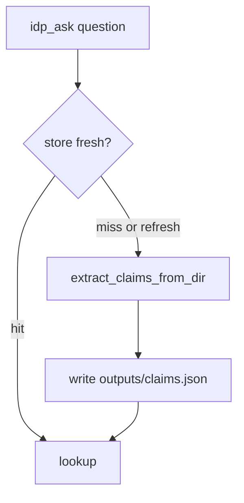

# Design: Local claim store

## Technical Approach

Keep extract and lookup unchanged. Add a cache in front of `extract_claims_from_dir` for the CLI only. Pytest evals keep extracting so gold does not depend on `outputs/`.

## Architecture Decisions

| Decision | Choice | Rejected | Why |
|----------|--------|----------|-----|
| Format | JSON in `outputs/claims.json` | SQLite; Postgres | No new dep; `outputs/` already gitignored |
| Freshness | PDF name + size + `mtime_ns` + directory path | Hash of file bytes | Cheap; enough for local corpus |
| Who uses it | `idp_ask.py` | Eval harness | Evals MUST re-extract vs recipe gold |
| Recipe edits | `--refresh` | Hash recipes into fingerprint | Slice stays PDF-scoped |

## Data Flow



## File Changes

| File | Action | Description |
|------|--------|-------------|
| `openspec/changes/ledgerlens-claim-store/` | Create | SDD |
| `schemas/store.py` | Create | Fingerprint + load/save |
| `scripts/idp_ask.py` | Modify | `--refresh`; `store` hit/miss in JSON |
| `tests/test_store.py` | Create | Spy extract; tmp_path |
| `README.md`, `docs/handoff-linux.md`, `docs/plan-siguiente-idp.md` | Modify | Pointers |

## Interfaces / Contracts

```text
load_claims(directory, store_path, *, force=False, extract=...) -> (claims, cached: bool)
fingerprint: {directory, sources: [{name, size, mtime_ns}]}
Claim round-trip via dataclasses.asdict
```

## Testing Strategy

| Layer | What | Approach |
|-------|------|----------|
| Unit | hit, miss, stale, force, corrupt JSON | pytest + fake extract; no pdftotext |
| Eval | identity_v1/v2 | unchanged; still call extract |
| CLI | `--refresh` | argparse smoke in unit test optional |

## Threat Matrix

No new subprocess. Cache is local JSON, not a network boundary.

| Boundary | Applicability | Design response | Planned RED tests |
|----------|---------------|-----------------|-------------------|
| Shell / subprocess | N/A | extract path unchanged | none |
| Git | Applicable: cache MUST NOT be committed | `outputs/` gitignored | check.sh already ignores outputs |

## Migration / Rollout

No migration. First CLI run writes the cache. Rollback: git revert this change; delete `outputs/claims.json`.

## Open Questions

- [x] JSON vs SQLite — JSON for this slice.
