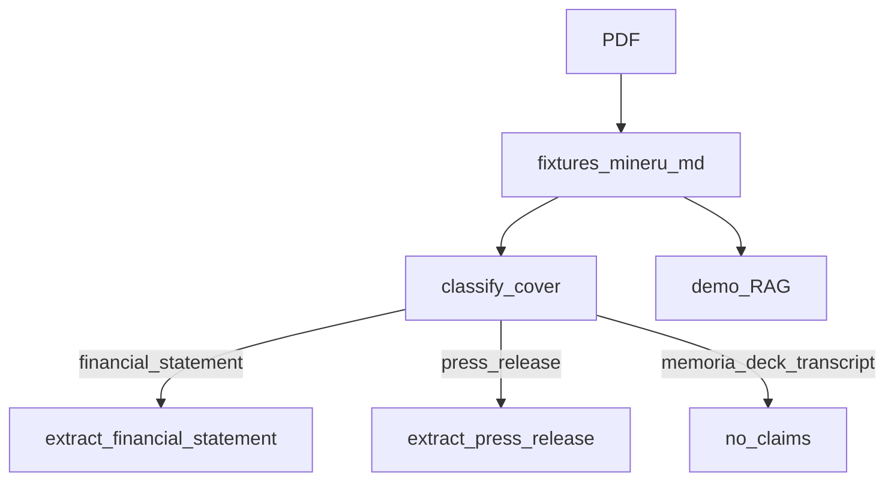

# Design: MinerU parse as the only identity path

## Technical Approach

One parse, many consumers. MinerU (already run in `demo_4`) is materialized as `fixtures/mineru/<stem>.md`. Classify and extract read that file. RAGFlow keeps its own copy of the same parse. Unify mapping: FileManager = artifact; KnowledgeManager = typed claims; chat chunks are not identity.

## Architecture Decisions

| Decision | Choice | Rejected | Why |
|----------|--------|----------|-----|
| Parse SoT | `fixtures/mineru/*.md` | Live `pdftotext`; live `mineru-api` in CI | 7 GB host; Docker-free evals |
| Classify | Cover of artifact (~8 pages / 16k chars) | Filename | Opaque names; industria = content |
| Memoria | `UNKNOWN` if cover has `memoria` | Extract P&L from annual dump | Gold already abstains; later pages look like EEFF |
| Missing .md | No claims | Fall back to poppler | Plan: no silent `pdftotext` |
| Refresh | `scripts/export_mineru.py` on demo host | Re-`POST /file_parse` by default | Dataset already DONE |
| Fingerprint | PDF stats + parse sha256 | PDF only | Claim cache must invalidate when parse changes |

## Data Flow

## File Changes

| File | Action |
|------|--------|
| `openspec/changes/ledgerlens-mineru-parse/` | Create SDD |
| `schemas/parse_artifact.py` | Load/flatten/split pages |
| `schemas/classify.py` | Cover → recipe |
| `schemas/extract.py`, `press_release.py`, `corpus.py` | Artifact not `pdftotext` |
| `schemas/store.py` | Parse hash in fingerprint |
| `scripts/export_mineru.py` | RAGFlow chunks → fixtures |
| `fixtures/mineru/` | Committed artifacts |
| README, handoff, testing, `openspec/config.yaml` | Rumbo |

## Testing Strategy

| Layer | What |
|-------|------|
| Unit | Cover snippets: EEFF / comunicado / memoria / deck |
| Integration | Fixtures vs recipe gold; memoria yields no P&L |
| Eval | identity_v1/v2 + press_v1 unchanged gold |

## Threat Matrix

Export script talks to RAGFlow on the demo host only. Kernel path is local files. Flatten strips HTML/markdown tables so fillers still see label+amount on one line.

## Rollback

Git revert this change. Do not leave a dual parser.
